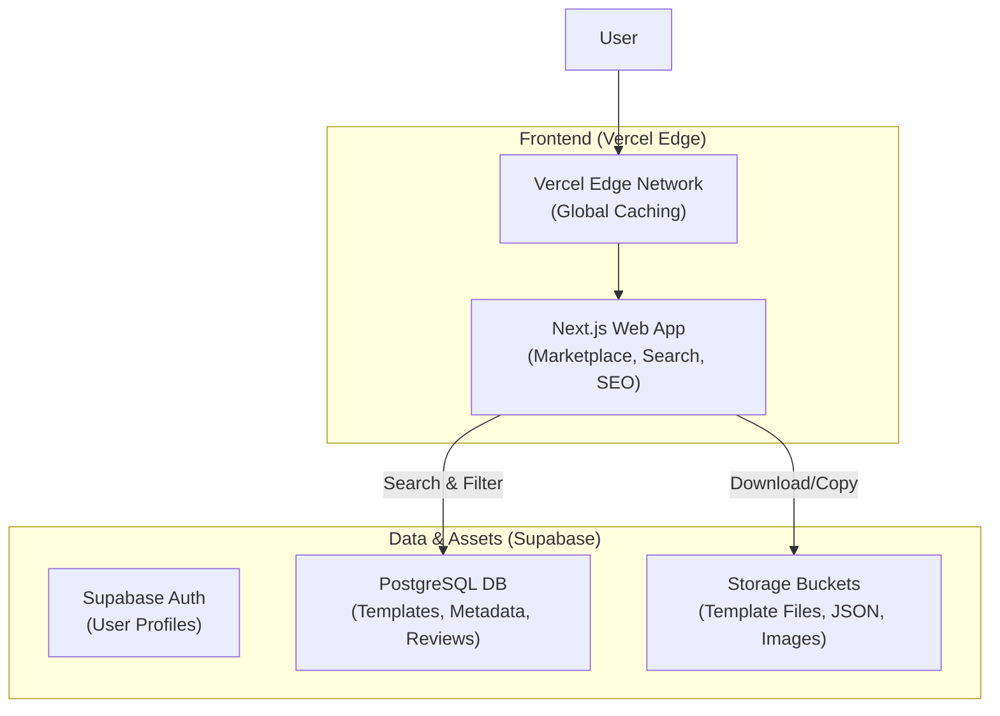

# AI Automation Marketplace (Templates) - Architecture & Implementation Plan

This document outlines the architecture for a scalable **Digital Asset Marketplace**. The goal is to serve 1 million users who want to browse, search, and download/copy high-quality automation workflows.

**Pivot:** This is a *Digital Asset Marketplace*, not a SaaS execution platform. We do not run the workflows; we host them.

## 1. System Architecture

### High-Level Design
The architecture is streamlined for **Read-Heavy** traffic (99% reads, 1% writes).

### Key Components
1.  **Frontend**: Next.js (App Router). Critical for SEO.
2.  **Database**: Supabase (PostgreSQL).
3.  **Storage**: Supabase Storage. Stores the actual template files (.json, .yaml, .zip) and screenshots.

### Technology Stack
| Layer | Technology | Role |
| :--- | :--- | :--- |
| **Database** | **Supabase** | Postgres + Storage + Auth. |
| **ORM** | **Prisma** | Data Access. |
| **Payments** | **Stripe Connect** | Marketplace Payouts & Payments. |
| **Email** | **Resend** | Transactional Emails (Receipts/updates). |

## 2. Updated Scope (Manual Marketplace)

To run a **Marketplace** (not just a website), we focus on these critical components:

### A. The Payment Engine (Stripe Connect)
*   *Flow:* User Buys -> Money splits (90% to Creator, 10% to You) -> Stripe Payouts.
*   *Tax:* Using **Stripe Tax** to handle compliance.

### B. Transactional Email
*   **Resend** for sending purchase receipts and download links.

### C. Admin & Quality Control
*   **Manual Review**: Since we removed the AI auto-checker, we need a simple Admin Dashboard.
*   Creators upload -> Status `pending` -> Admin reviews -> Status `published`.

## 3. Data Model (Schema Design)

### Core Tables
*   **`profiles`**: User data (Creator vs Consumer).
*   **`templates`**: The core asset.
    *   `id`, `title`, `slug` (for SEO), `description`.
    *   `price` (0 for free), `currency`.
    *   `category` (Marketing, Dev, HR).
    *   `tool_stack` (Array: ["n8n", "OpenAI", "Gmail"]).
    *   `tags` (Array: Text tags for filtering).
*   **`template_versions`**:
    *   `id`, `template_id`, `version_number` (1.0, 1.1).
    *   `file_url` (Link to Storage).
    *   `changelog`.
*   **`interactions`**:
    *   `views`, `downloads`, `likes`. Used for "Trending/Popular" logic.

## 4. Phase 1 Implementation Plan

### Step 1: Foundation
- [ ] Initialize Next.js 14+ project (UI: Shadcn/Shadcn).
- [ ] Set up Supabase Project.

### Step 2: The Core Marketplace
- [ ] **Submission Flow**: UI for creators to upload `.json` files, add screenshots, and write descriptions manually.
- [ ] **Catalog UI**: Grid view of templates with text-based search and filters.
- [ ] **Template Page**: Rich detail page.

### Step 3: Payments & Delivery
- [ ] Integrate Stripe Connect for Sellers.
- [ ] Implement Checkout flow.
- [ ] Implement Resend for email delivery.

### Step 4: Admin
- [ ] Simple Admin Dashboard to Approve/Reject submissions.

## 5. Technology Stack Summary

- **Frontend**: Next.js, React, Tailwind, Framer Motion.
- **Backend**: Next.js API Routes (Serverless).
- **Database**: Supabase.
- **Validation**: Zod.
