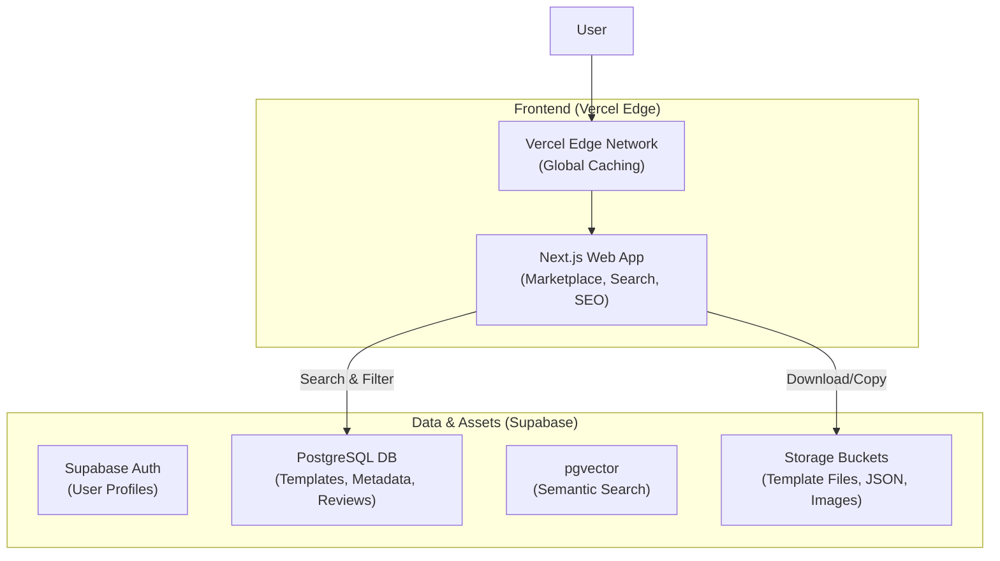

.# AI Automation Marketplace (Templates) - Architecture & Implementation Plan

This document outlines the architecture for a scalable **AI Automation Template Marketplace**. The goal is to serve 1 million users who want to browse, search, and download/copy high-quality AI automation workflows (e.g., n8n, Zapier, LangChain configs).

**Pivot:** This is a *Digital Asset Marketplace*, not a SaaS execution platform. We do not run the workflows; we host them.

## 1. System Architecture

### High-Level Design
The architecture is streamlined for **Read-Heavy** traffic (99% reads, 1% writes).

### Key Components
1.  **Frontend**: Next.js (App Router). Critical for SEO. We want these templates to rank high on Google.
2.  **Database**: Supabase.
    *   **pgvector**: Essential. Users often don't know the tool name, they know the problem. "Automate invoice processing" should find the relevant n8n template via vector search.
3.  **Storage**: Supabase Storage. Stores the actual template files (.json, .yaml, .zip) and screenshots/diagrams of the workflow.

### Key Database Decision: Supabase + Prisma
We will use the "Best of Both Worlds" stack:
1.  **Infrastructure (Supabase)**: Hosting the specialized Postgres instance (with `pgvector`), Auth, and File Storage.
2.  **Data Access (Prisma)**: Used in Next.js API routes to provide Type Safety and easy migrations.
3.  **Processing (Trigger.dev)**: Runs the "Ingestion Analysis" pipeline in the background.

| Layer | Technology | Role |
| :--- | :--- | :--- |
| **Database** | **Supabase** | Postgres + pgvector. |
| **ORM** | **Prisma** | Data Access. |
| **Ingestion** | **Trigger.dev** | Background Analysis (Free). |
| **AI Model** | **Groq** | Cheap Llama 3 Inference. |
| **Payments** | **Stripe Connect** | **(UPDATED)** Marketplace Payouts & Payments. |
| **Email** | **Resend** | **(NEW)** Transactional Emails (Receipts/updates). |

## 2. Gap Analysis (What was missing?)

To run a **Marketplace** (not just a website), you were missing three critical components:

### A. The Payment Engine (Stripe Connect)
*   *Decision:* Replacing Lemon Squeezy with **Stripe Connect**.
*   *Why?* Lower fees (2.9% + 30¢ vs LS's 5%+).
*   *Trade-off:* You and your sellers are responsible for tax compliance (VAT/GST). We will use **Stripe Tax** to help calculate it, but you are the Merchant of Record.
*   *Flow:* User Buys -> Money splits (90% to Creator, 10% to You) -> Stripe Payouts.

### B. Transactional Email / Delivery
*   *Problem:* Supabase Auth sends "Confirm Email", but how do you send "Here is your invoice"?
*   *Solution:* **Resend**.
    *   Integrates perfectly with Next.js/React Email.
    *   We will use this to email the downloaded file link to the buyer.

### C. The "Admin" Queue
*   *Problem:* Spammers will upload fake templates.
*   *Solution:* We need a `status: 'pending'` flag in the Database and a hidden `/admin` page where you can approve/reject templates before they appear in search.

## 3. Ingestion Pipeline (The "Scan" Flow)
When a template is uploaded:
1.  **Upload**: File goes to Supabase Storage.
2.  **Trigger**: Trigger.dev job activates.
3.  **Analysis**: Job sends file content to **Groq (Llama 3)**.
    *   *Prompt:* "Analyze this JSON. Extract the tool names, complexity (Low/Med/High), and write a summary."
4.  **Save**: Trigger.dev writes the tags/summary back to Supabase `templates` table.

## 3. Scalability Strategy (10 Lakh Users)

## 3. Data Model (Schema Design)

### Core Tables
*   **`profiles`**: User data (Creator vs Consumer).
*   **`templates`**: The core asset.
    *   `id`, `title`, `slug` (for SEO), `description`.
    *   `price` (0 for free), `currency`.
    *   `category` (Marketing, Dev, HR).
    *   `tool_stack` (Array: ["n8n", "OpenAI", "Gmail"]).
    *   `embedding`: Vector(1536).
*   **`template_versions`**:
    *   `id`, `template_id`, `version_number` (1.0, 1.1).
    *   `file_url` (Link to Storage).
    *   `changelog`.
*   **`interactions`**:
    *   `views`, `downloads`, `likes`. Used for "Trending" logic.

## 4. Phase 1 Implementation Plan

### Step 1: Foundation
- [ ] Initialize Next.js 14+ project (UI: Shadcn/Shadcn).
- [ ] Set up Supabase with `pgvector` extension enabled.

### Step 2: The Core Marketplace
- [ ] **Submission Flow**: UI for creators to upload `.json` files, add screenshots, and write descriptions.
- [ ] **Catalog UI**: Grid view of templates with filters (Tool, Category, Price).
- [ ] **Template Page**: Rich detail page.
    *   *Stretch Goal*: Render a visual graph of the JSON workflow (if compatible with n8n/React Flow).

### Step 3: Search Engine
- [ ] Implement Semantic Search algorithm (OpenAI Embeddings -> Supabase RPC).
- [ ] Implement Semantic Search algorithm (OpenAI Embeddings -> Supabase RPC).
- [ ] Build "Related Templates" recommender.

### Step 3.5: Deployment & CI/CD
- [ ] **Staging Environment**: Configure Vercel Branch Domains.
    -   `main` branch -> `createconomy.com` (Production)
    -   `dev` branch -> `dev.createconomy.com` (Staging/Validation)

### Step 4: Community Features
- [ ] User Reviews/Ratings.
- [ ] "Creator Profiles" (Showcase all templates by one user).

## 5. Technology Stack Summary

- **Frontend**: Next.js, React, Tailwind, Framer Motion (for "wow" factor).
- **Backend**: Next.js API Routes (Lightweight), Trigger.dev (Heavy Lifting).
- **Database**: Supabase (PostgreSQL).
- **AI/LLM**: LangChain.js or Vercel AI SDK.
- **Validation**: Zod (for validating JSON schemas of inputs).

## User Review Required
> [!IMPORTANT]
> **Async Implementation**: We need to choose the Async provider. I have recommended **Trigger.dev** because it integrates natively with Vercel and offers great DX for TypeScript. Are you okay with adding this infrastructure piece? (It has a generous free tier and open-source option).
